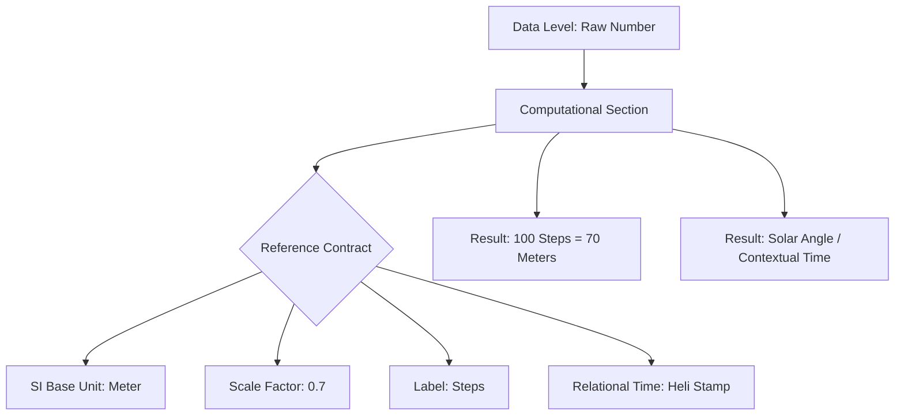

# Plan: Units Reference Contract Refactor (SI & Heli-Based)

## Overview
Refactor the units system to use the 7 SI base units as the foundation, while introducing the **Heli Stamp** as a contextual alternative to the "Second" for relational time. This allows for derived units and scaling (e.g., meters to kilometers or steps) via computational logic.

## References
- [SI Base Units (Wikipedia)](https://en.wikipedia.org/wiki/SI_base_unit)
- [SI Base Units (BIPM)](https://www.bipm.org/en/measurement-units/si-base-units)
- [DBpedia RDF for Units](https://dbpedia.org/page/International_System_of_Units)

## Proposed Schema Changes (`src/schemas/units.json`)
The schema should be updated to include:
- **Base Unit**: One of the 7 SI units (m, kg, s, A, K, mol, cd) or **Heli** (for relational time).
- **Scale Factor**: A multiplier (e.g., 10^3 for kilo).
- **Label/Alias**: Human-readable name (e.g., "Steps").
- **Metadata**: Links to SI/BIPM/DBpedia references.

## Proposed Logic in `src/referencecontracts/unitsRef.js`
- `unitsPrepare(input)`: Should accept a base unit and optional scaling/labeling.
- Support for `heli` as a time-based unit type.
- Validation against the new schema.

## Integration
- Add `UnitsReferenceContract` to `ReferenceContractComposer` in [`src/composers/rcComposer.js`](src/composers/rcComposer.js).
- Implement `unitsComposer` method.

## Mermaid Diagram

